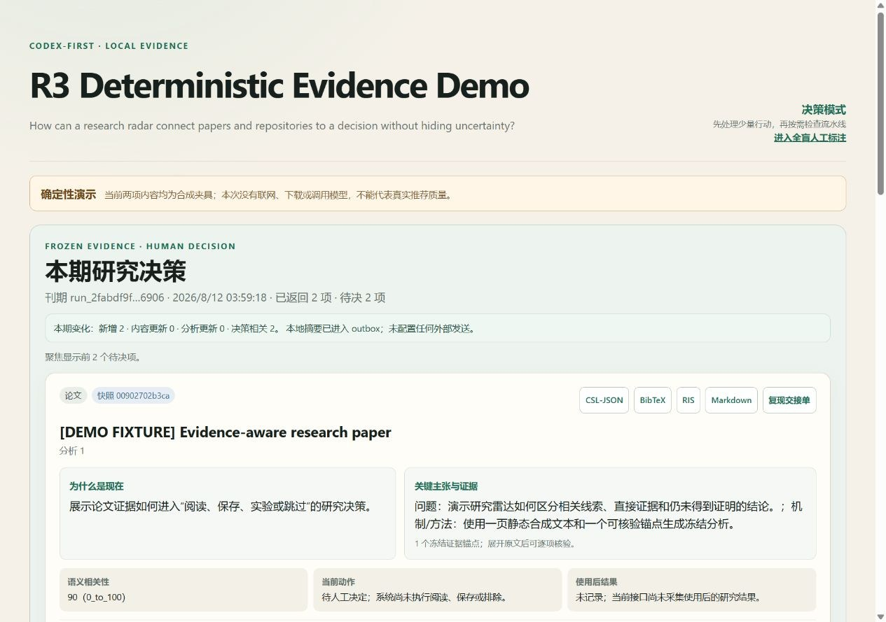
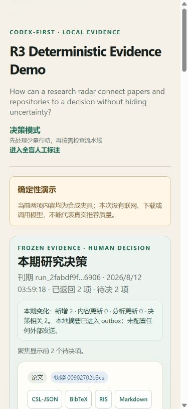
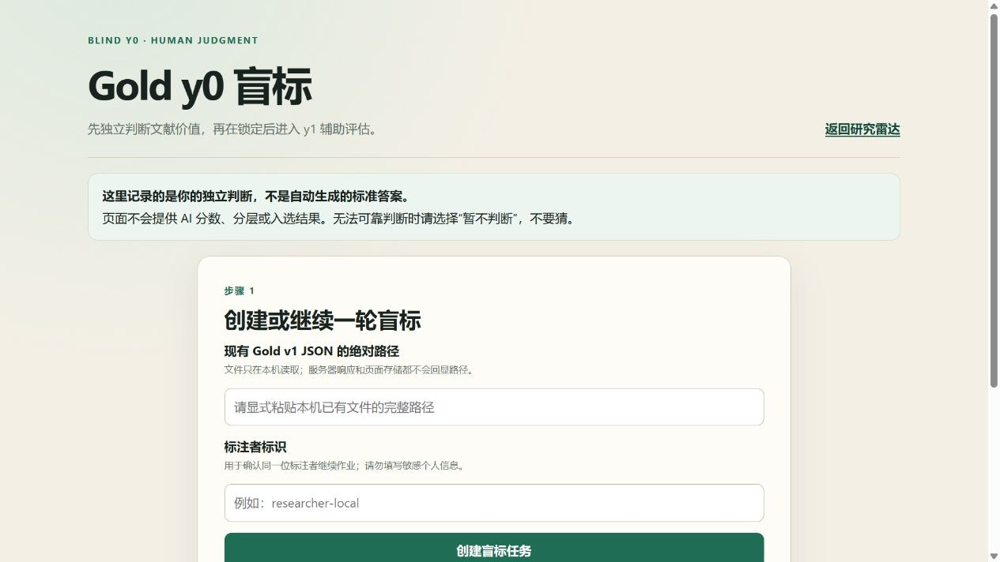
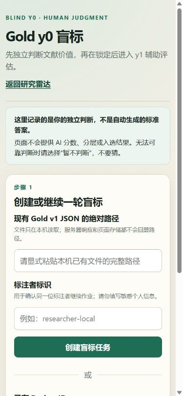

# R3 Research Radar

> **Decision-grade research radar for papers and code — find fewer, verify deeper, act with evidence.**

[](https://github.com/Frogjiangs/r3-research-radar/actions/workflows/ci.yml)
[](LICENSE)

[中文文档](README.zh-CN.md) · [Capabilities](docs/CAPABILITIES.md) ·
[Architecture](docs/ARCHITECTURE.md) · [Evaluation](docs/EVALUATION.md) ·
[Contributing](CONTRIBUTING.md)

R3 Research Radar is a local, single-user research pipeline that discovers papers
and GitHub repositories, retrieves static source material, performs evidence-gated
deep reading, and turns a small number of candidates into auditable research
decisions.

It is not another general-purpose report generator. R3 keeps discovery separate
from recommendation, records what was and was not read, and preserves evidence
anchors, content hashes, model receipts, policy versions, and decision snapshots.

> **Alpha status:** `v0.2.0a1` is being prepared for public evaluation.
> The complete hardened path is currently validated only on Windows 10/11 with
> CPython 3.10. Linux, Docker, PyPI publication, multi-user hosting, and unattended
> cloud operation are not claimed.



*Deterministic two-item demo: synthetic evidence, zero network calls, and zero
model calls. It demonstrates the product workflow, not recommendation quality.*

<details>
<summary>Mobile decision view and blind Gold review</summary>

| Decision view · mobile | Gold y0 review · desktop | Gold y0 review · mobile |
|---|---|---|
|  |  |  |

The Gold page deliberately hides R3 scores, tiers, selections, and AI analyses
until all independent y0 judgments are frozen. An AI model must not replace the
human Gold labels used to evaluate that model-assisted system.

</details>

## Why R3?

Most research tools optimize for more results or longer reports. R3 optimizes for
a different question:

> Which paper or repository is important enough to change the next research
> decision, and what exact evidence supports that judgment?

The current implementation provides:

- joint discovery of papers and GitHub repositories;
- official-source verification before a candidate can become a recommendation;
- static, non-executing repository inspection;
- recoverable full-content and selected-corpus deep reading;
- verbatim evidence anchors and coverage accounting;
- visible blocked, incomplete, rejected, historical, and current-policy states;
- frozen decision slices and reproducibility exports;
- rate limits, backoff, request budgets, disk guards, and loopback-only UI.

See [Capabilities](docs/CAPABILITIES.md) for the exact supported and unsupported
surface.

## Quickstart

The public alpha is not published to PyPI. The hardened setup builds and validates
a fresh wheel and sdist, installs that wheel into `.venv`, and then prepares the
pinned local tooling:

```powershell
.\scripts\SETUP.ps1

r3radar create-profile --output research.profile.json
r3radar --config research.profile.json doctor
r3radar demo --prepare-only
```

Every console command has a module fallback:

```powershell
.\.venv\Scripts\python.exe -m r3radar --config research.profile.json doctor
.\.venv\Scripts\python.exe -m r3radar demo --prepare-only
```

`r3-radar` is installed as an equivalent hyphenated console alias.

Create a research profile before using live sources:

```powershell
r3radar create-profile
# module fallback
.\.venv\Scripts\python.exe -m r3radar create-profile
```

`demo` uses deterministic bundled fixtures and does not prove live-source or
model quality. Live-source smoke and dashboard commands remain:

```powershell
.\scripts\RUN_SMOKE.ps1
.\scripts\START_DASHBOARD.ps1
```

For API keys, live backfill, recovery, scheduled runs, model fallbacks, and the
full security boundary, read [README.zh-CN.md](README.zh-CN.md).

## Typical workflow

```text
research profile
      |
official APIs + bounded hosted discovery
      |
metadata verification and objective admission gates
      |
paper/repository content acquisition
      |
evidence-gated deep reading
      |
ranking, decision slice, feedback and exports
```

Generate a report for one explicit run:

```powershell
r3radar report --run-id <run-id>
# module fallback
.\.venv\Scripts\python.exe -m r3radar report --run-id <run-id>
```

The explicit run ID prevents an accidental report from silently mixing unrelated
or stale runs.

## Evidence model

A discovery hit is not a recommendation. A candidate may advance only after the
configured objective gates and official-source verification. Admitted candidates
must then obtain usable content and satisfy the configured evidence coverage
policy. Missing content, incomplete coverage, exhausted budgets, and provider
failures remain visible rather than being rewritten as success.

For large repositories, R3 can select a research-relevant corpus while retaining
the full file manifest and exclusion reasons. This reduces exhaustive model calls
without hiding what was omitted.

Existing cached repository ZIPs can be evaluated against the current selector
without network or model calls:

```powershell
r3radar --config <profile.json> reproject-repositories
```

The command is a dry run unless `--apply` is supplied. It reports old and new
chunk counts, planned model calls, budget headroom, included files, and
exclusions before any revision is written or task is queued.

See [Architecture](docs/ARCHITECTURE.md) for invariants and trust boundaries.

## Evaluation status

Claims are deliberately separated:

- **Engineering regression:** the authoritative count and result come from the
  generated `r3/verification-receipt/v1` CI artifact; this README deliberately
  does not duplicate a hand-maintained test count.
- **Deterministic demo:** validates onboarding and rendering without live APIs.
- **Bounded focus run:** 15 admitted items completed under one recorded current
  model policy; this proves that run's provenance, not general recommendation
  quality.
- **Human relevance quality:** a prospective, labeled benchmark is still missing.

Engineering tests do not prove recommendation quality or product-market fit.
Details and required next evidence are in [Evaluation](docs/EVALUATION.md).

For human calibration, open `/gold-review`, explicitly import a frozen 70-item
v1 draft, and finish every blind y0 judgment before any AI-assistance stage.
The page never treats AI output as Gold truth. Independent 20–35 item
known-answer sets can be validated and evaluated offline with:

```powershell
r3-radar known-answer-validate --help
r3-radar known-answer-evaluate --help
```

## Security summary

- Official APIs, caching, shared per-host throttles, `Retry-After`, and circuit
  breaking are preferred over broad scraping.
- R3 does not bypass CAPTCHAs, rotate proxies, impersonate many users, or switch
  silently to unknown mirrors.
- Repository archives are read statically. Their scripts, hooks, binaries,
  dependencies, and Actions are not executed.
- Redirects and requests reject userinfo, HTTPS downgrade, and non-public
  destinations; size, decompression, path traversal, disk, and run budgets are
  enforced.
- The dashboard is loopback-only and logs exclude request headers and secrets.
- Model providers may receive selected content. “Local-first” does not mean every
  configured model path is fully local.

The detailed controls and recovery semantics are preserved in
[README.zh-CN.md](README.zh-CN.md).

## Development

```powershell
.\.venv\Scripts\python.exe -m unittest discover -s tests -v
.\.venv\Scripts\python.exe -m compileall -q r3radar
```

Contributions must preserve evidence provenance and must not weaken source,
network, content, or model boundaries without an explicit design change. Read
[CONTRIBUTING.md](CONTRIBUTING.md) before opening a change.

## Project status and licensing

This repository is alpha software. Interfaces and stored schemas may still
change. The R3 source code is available under the [MIT License](LICENSE).
Third-party packages, retrieved research content, external repositories, and
configured model or API providers retain their own licenses and terms; see
[Third-party notices](THIRD_PARTY_NOTICES.md).
